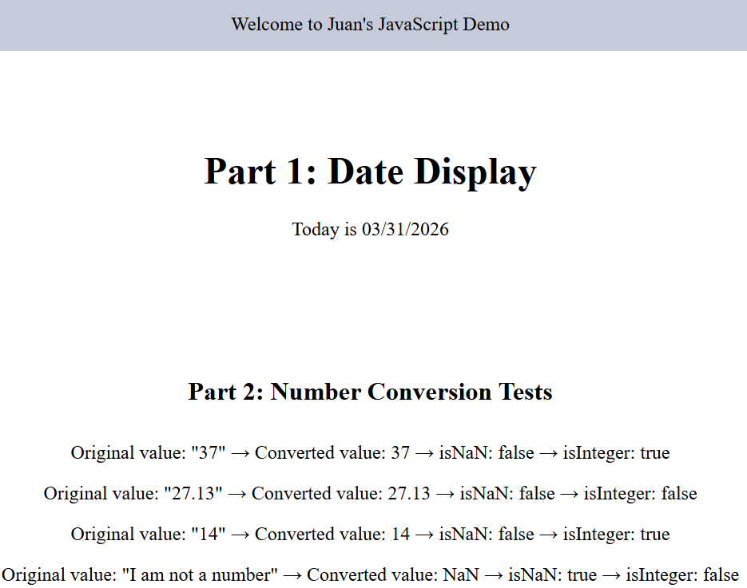

# JavaScript Built-in Objects and DOM Manipulation

## 1. Built-in Objects and Methods Used

* **`Date` Object:** `new Date()`, `getFullYear()`, `getMonth()`, `getDate()`
* **`Number` Object:** `Number()`, `Number.isInteger()`, `Number.isNaN()`, `toFixed()`
* **`document` (DOM) Object:** `getElementById()`, `createElement()`, `appendChild()`
* **Properties:** `textContent`, `innerHTML`

## 2. Live Project Link

- Repo Link: https://github.com/gtech29/comp484-hw9
- GH Pages Link: [gtech29.github.io/comp484-hw9/](https://gtech29.github.io/comp484-hw9/ "https://gtech29.github.io/comp484-hw9/")

## 3. Project Screenshot

## 4. Reflection

Installation of the first HTML elements and formatting of the current date was the least difficult part of this assignment. The most difficult part was to find out how to insert more than one variable into an object to be able to safely pass the variables through functions without re-rendering sections. Date object also assisted me on extracting specific dates like the month and year and make them dynamic. Depending on the Number object, I became accustomed to changing the strings into useful numbers and ensuring they have accurate data types of numbers with the assistance of other functions like the isNaN() ones. Finally, I have found that when I got the results into the browser, I began to understand that it takes more than just a value returned in JavaScript so that you can actually see something on the screen and that you need to create elements and literally attach them to the DOM.

## 5. Works Cited

* [W3Schools: JavaScript Tutorial](https://www.w3schools.com/js/default.asp)
